# Operationalizing Machine Learning with Azure 

In this project, we will use an AutoML model implemented using Azure Machine Learning in order to predict whether or not someone will be part of a marketing campaign promoted by the bank. This model will be further deployed in the cloud using an Azure Container Instance and a pipeline of the process will also be deployed. Both model and pipelines can be accessed through REST endpoints. 

## Architectural Diagram
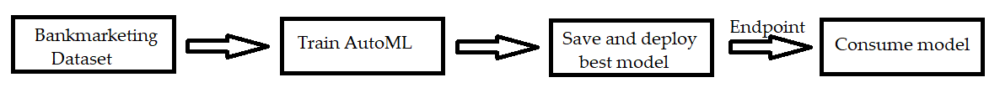

In this diagram, we have four basic steps:
- Input dataset: Here we use the bankmarketing dataset to feed the model.
- Train the model: We use AutoML in Azure's Machine Learning workspace to try different models and scaling methods, in order to obtain the best one according to the limits you choose (training time, evaluation metric etc).
- Deploy the model: Once we have our model working, we deploy it in Azure. more specifically, we use an Azure Container Instance with 1 CPU and 2GB RAM. This deployed model we'll be used only for scoring later (see next step).
- Consume the model: Lastly, the model is consumed via an endpoint (REST API). A JSON file is `POST`ed to the endpoint and we `GET` the prediction as a result. 

## Key Steps
First of all, the Bankmarketing dataset was uploaded as an Azure Dataset:
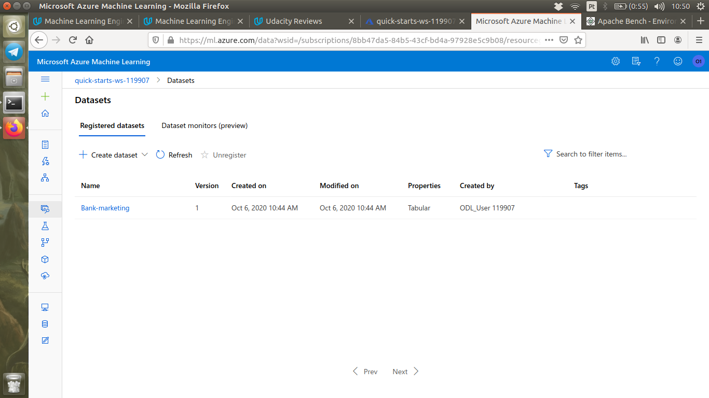

Then the AutoML algorithm was run to select the best algorithm to use in the predictions. When the experiment completed, the best model was a Voting Ensemble, as can be seen here:
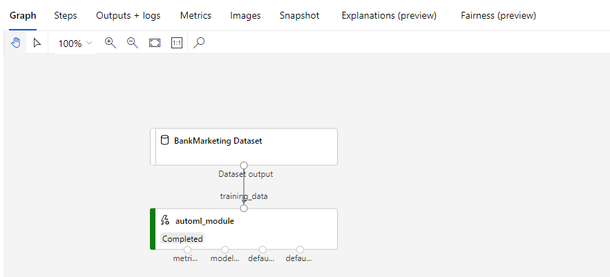

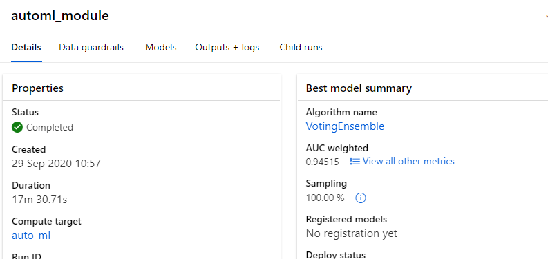

The best model was then deployed and the logs.py script was run to enable Application Insights for this model. In the screenshot below, we see the deployed model with the Application Insights enabled.
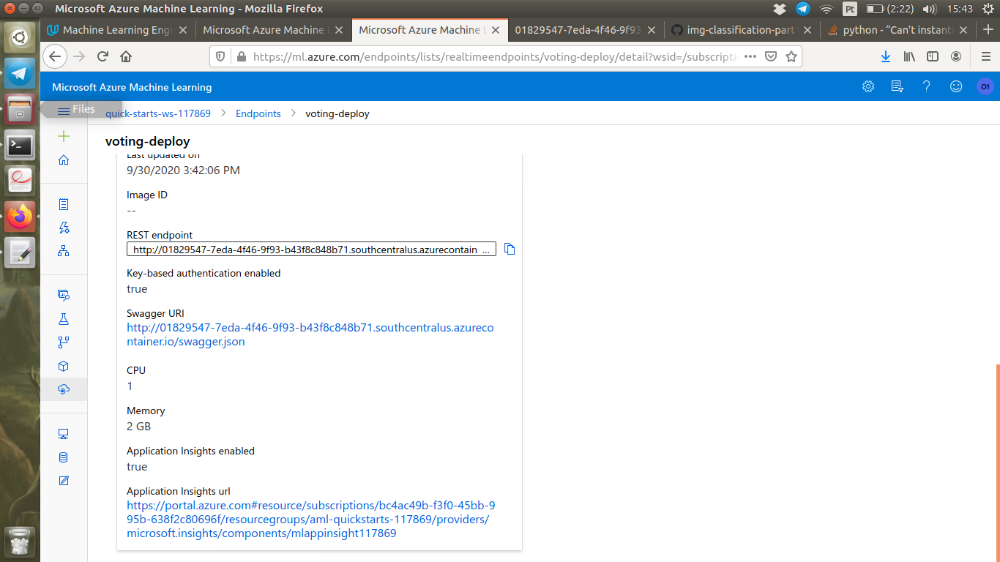

Here is the `logs.py` output after running as well:
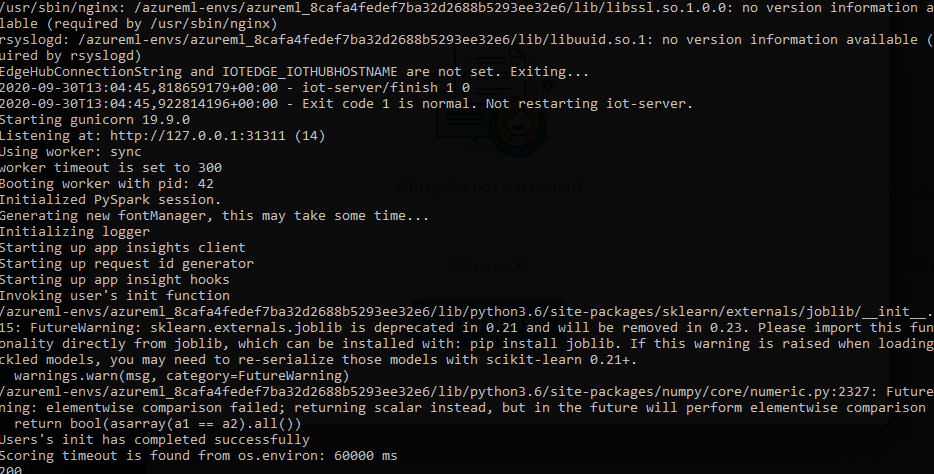

Once the endpoint was active, we could use Swagger to look at its methods and responses, as can be seen in the following screenshots:
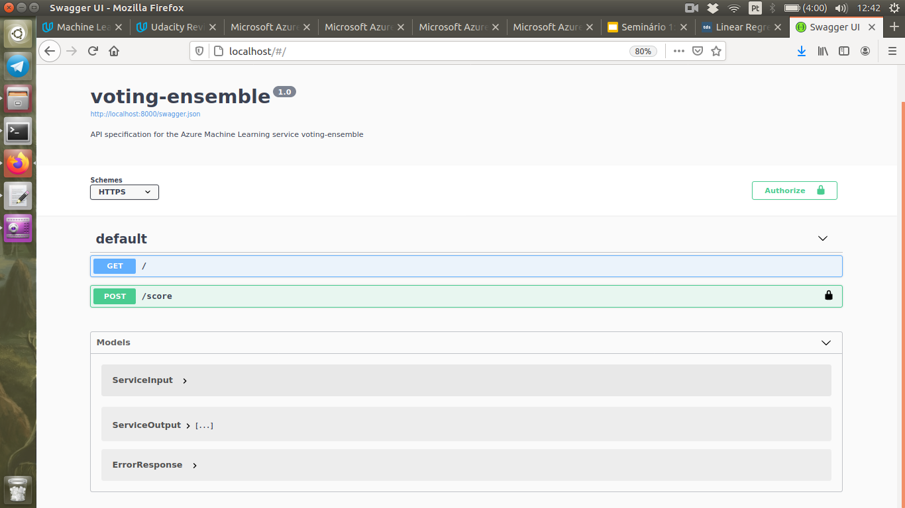

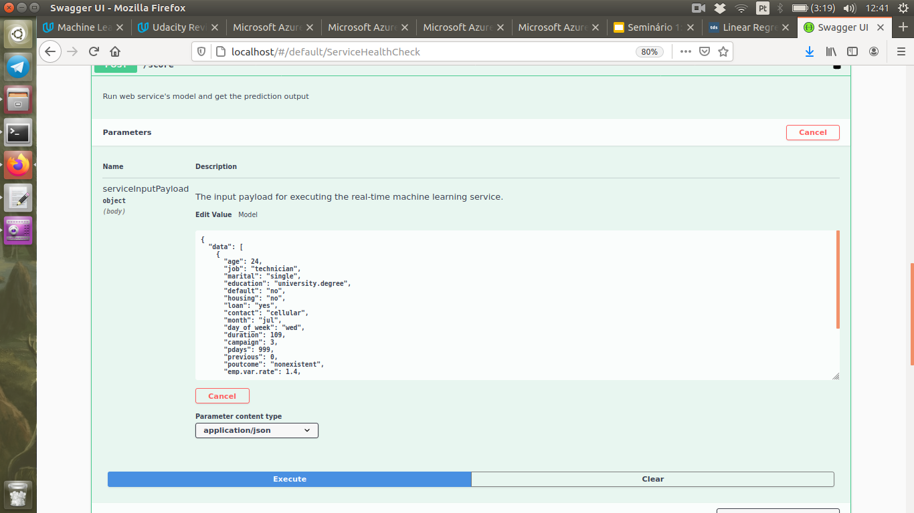

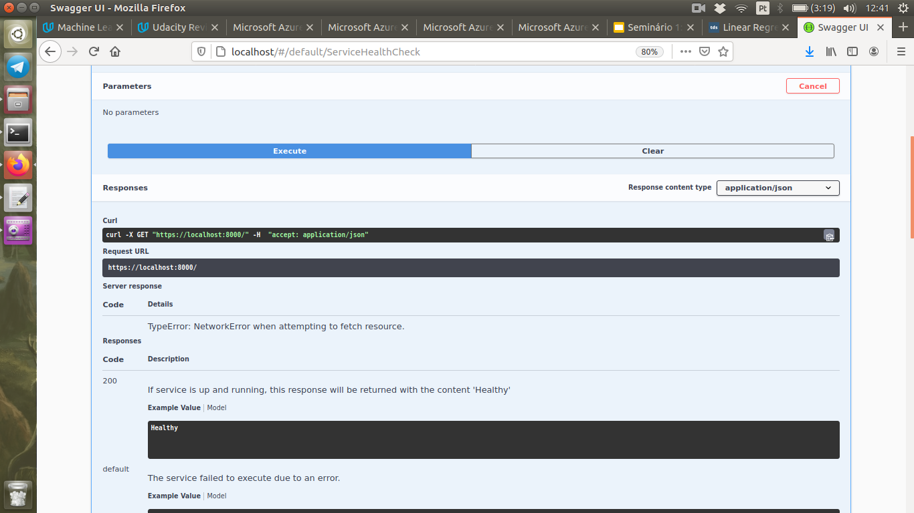

We could also use Apache Benchmark to know what would be the acceptable performance of our endpoint working under normal conditions:

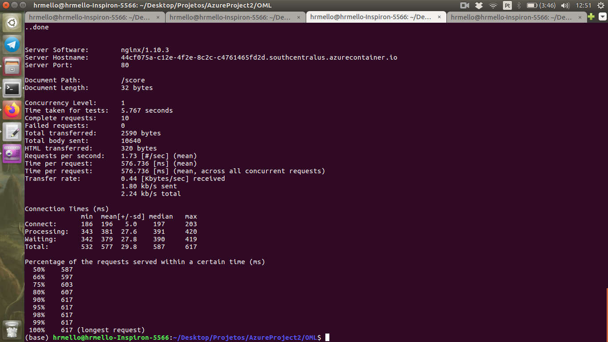

After that, we were able to consume the model using its REST API and the `endpoints.py` script. 
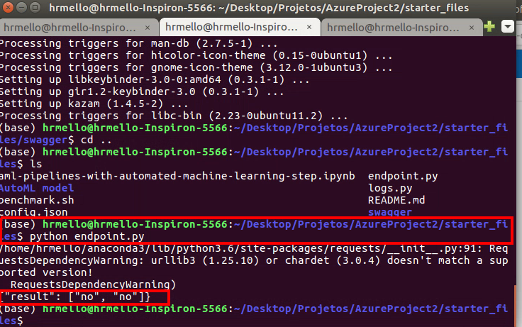

Next, I ran the notebook provided in the starter files in order to create and publish a pipeline, and its scheduled run. 
Here is a screenshot of the pipeline running:
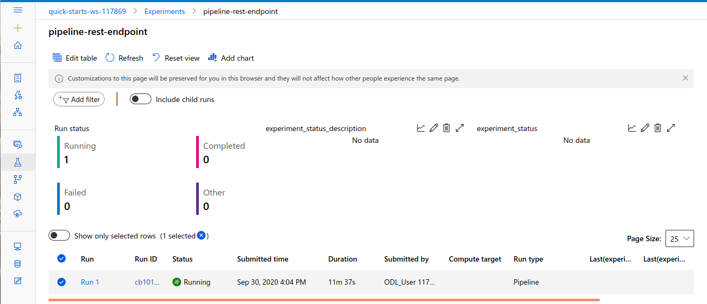

While in the notebook, we see the RunDetails command showing all the steps performed:
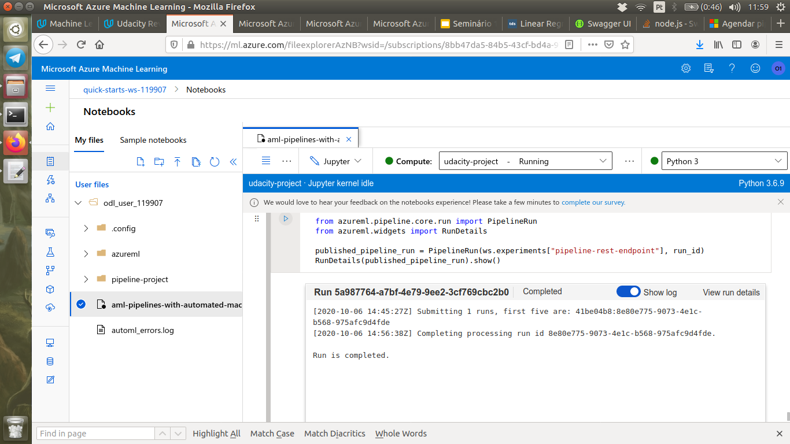

And one after it has finished, it is posible to find in Published Pipeline overview its REST endpoint, with its Status as Active and the pipeline itself shown on the left.

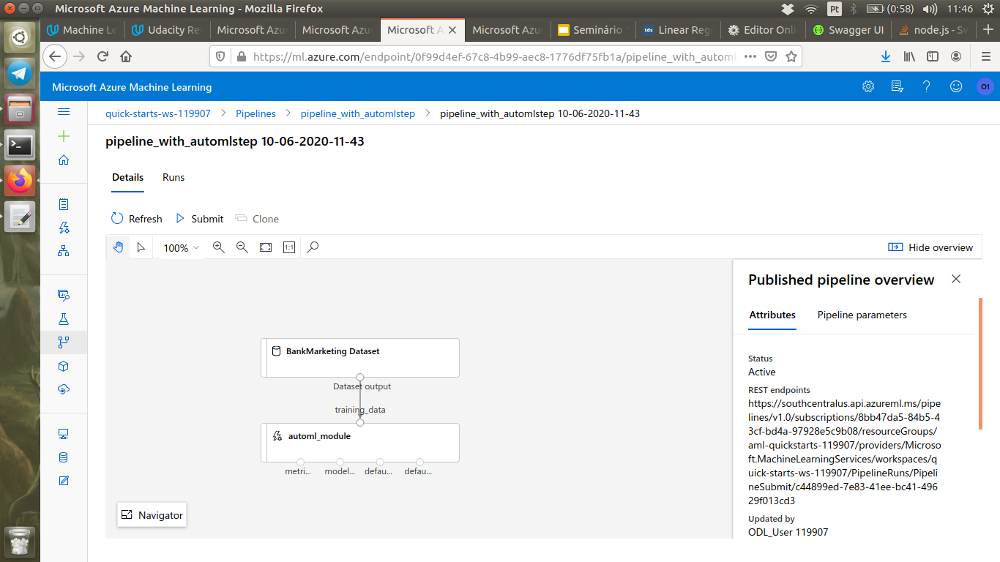

And on Pipeline Endpoints, we see our pipelines and also their Active statuses.
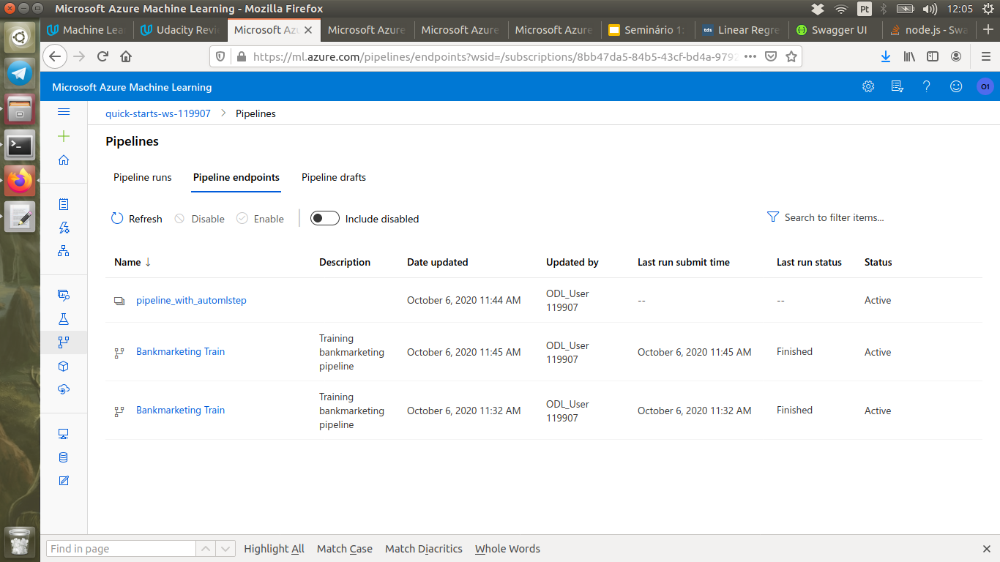

And also the scheduled runs:
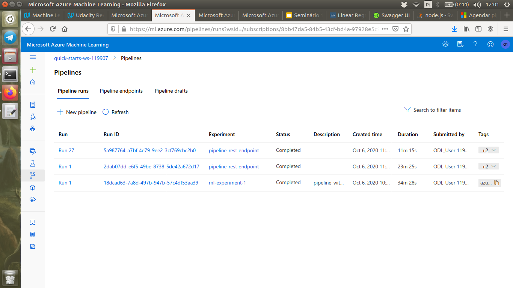

## Improvement steps
In the future, the performance of the algorithm may be better if we let the model train for more time. However, the accuracy is already very high and it has probably reached the possible limit performance for a machine learning algorithm using the present dataset. An alternative to improve the accuracy would be to acquire more data and run AutoML again. 

Another possible improvement would be to try using Deep Learning, which is currently not used by AutoMl in the runs we tried.

## Screen Recording
https://youtu.be/5egyHn5UPi4

(if for any reason the link doesn't work, the video is in the github repository, called endpoint_final.mp4
